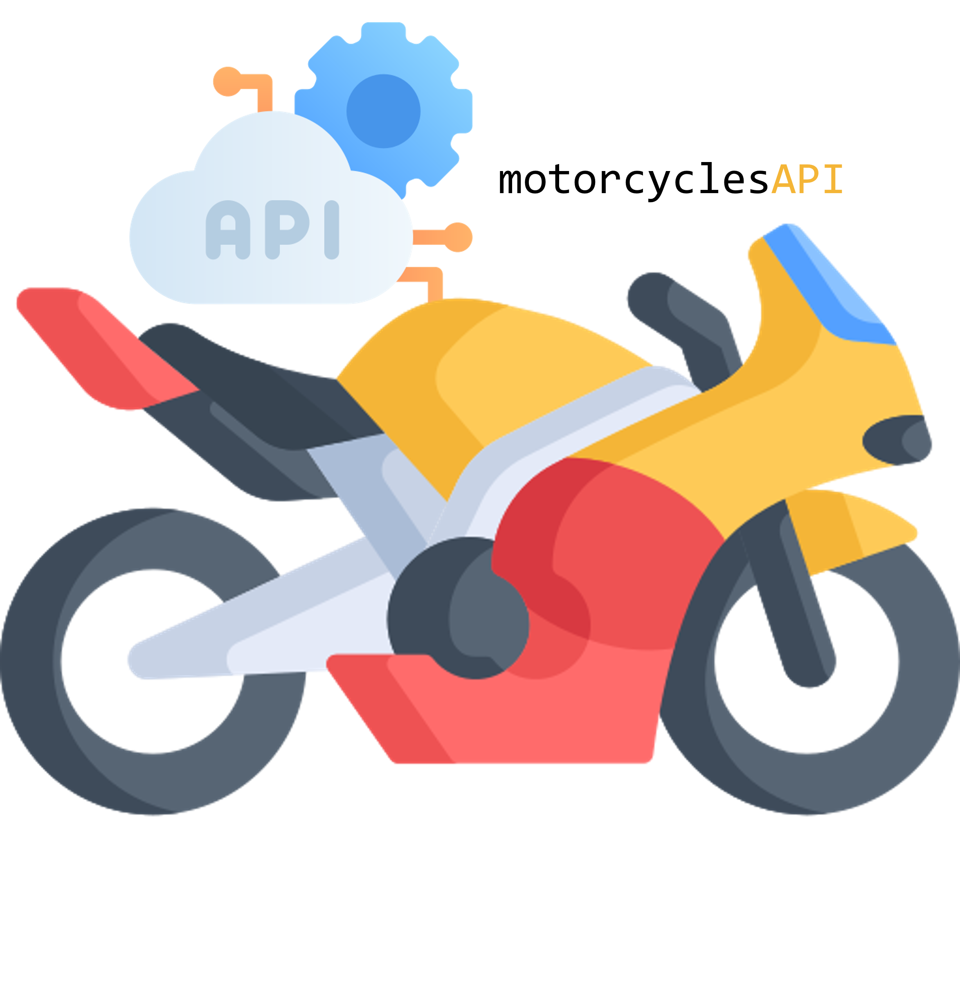

<a src='https://www.rplumber.io/'></a>


<a href="mailto:ivan.rafa.16@gmail.com" rel="nofollow"></a>
<br>


[](https://coveralls.io/github/ivanSantos16/motorcyclesAPI?branch=main)

<h1 style="text-align: left;">motorcycles<span style="color: #00b336">$\color[rgb]{0.95,0.71,0.22} API$</span></h1>

<p style="text-align: justify;">This simple API allows the user to get info about Motorcycles. </p>

## **Features**

- [x] JWT Authentication;
- [x] CRUD operations;
- [x] Swagger UI documentation;
- [x] Units tests for all endpoints with CI integration using GitHub Actions;
- [ ] Containerization of the application. One container for flask app and other for postgres database;
- [ ] ETL script capable of import for API database data from Kaggle;

## **Quick Start**
### Setup
1. Clone the repository
```bash
git clone https://github.com/ivanSantos16/underwritingSoftware.git
```
2. Create missing file on repository root directory
```bash
touch .env
touch .flaskenv
```

3. Add the following content to the .env file
```bash
export SECRET_KEY=<your_secret_key>
```  

4. Add the following content to the .flaskenv file
```bash
export FLASK_ENV=<development/production>
export FLASK_APP=<location_of_app>
export FLASK_DEBUG=<1/0>
export SQLALCHEMY_DB_URI=<your_db_uri>
export JWT_SECRET_KEY=<your_jwt_secret_key>
```

5. Create a virtual environment and install the requirements
```bash
python3 -m venv venv
venv/scripts/activate
pip install -r requirements.txt
```

6. Run the application
```bash
flask run
```